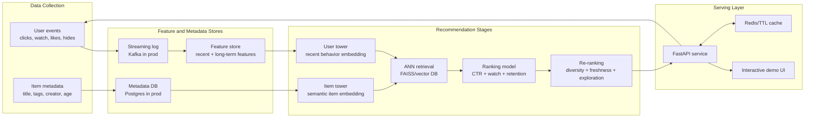

# Real-Time Multi-Stage Recommendation System

An interview-ready ML systems project that mirrors a TikTok/YouTube-style recommender:

- Retrieval: two-tower user/item embeddings narrow the catalog to candidates.
- Ranking: a multi-objective ranker balances CTR, watch time, and retention.
- Re-ranking: diversity, freshness, and exploration shape the final slate.
- Real-time feedback: user events update recent features immediately.
- MLOps: offline evaluation, feature backfill, monitoring, and Render deployment config.

The live service is intentionally lightweight so it can deploy cleanly on Render free/starter instances. The optional training path uses PyTorch and FAISS without making the production API depend on heavy ML packages.

## Demo

```bash
pip install -r requirements.txt
pip install -e .
uvicorn app:app --reload
```

Open:

- Dashboard: http://localhost:8000
- Swagger docs: http://localhost:8000/docs
- Health check: http://localhost:8000/healthz

Example recommendation request:

```bash
curl -X POST http://localhost:8000/api/recommendations \
  -H "Content-Type: application/json" \
  -d '{"user_id":"u_alex","k":10,"candidate_pool":60,"context":{"device":"web","region":"US"},"use_cache":false}'
```

Example real-time feedback event:

```bash
curl -X POST http://localhost:8000/api/events \
  -H "Content-Type: application/json" \
  -d '{"user_id":"u_alex","item_id":"vid_001","event_type":"like","value":1.0}'
```

## Architecture



## What Is Implemented

- `src/realtime_recs/retrieval.py`: retrieval index with a dependency-free ANN stand-in and optional FAISS adapter.
- `src/realtime_recs/ranker.py`: inspectable multi-objective ranker.
- `src/realtime_recs/reranker.py`: diversity, creator de-duplication, freshness, and epsilon exploration.
- `src/realtime_recs/features.py`: recent and long-term user features, event weights, freshness, affinity, and skew-aware serving features.
- `src/realtime_recs/embeddings.py`: deterministic local embeddings plus an optional OpenAI embeddings provider for offline semantic vectors.
- `src/realtime_recs/api.py`: FastAPI dashboard/API, health checks, metrics, CORS, and event ingestion.
- `src/realtime_recs/pipelines/train_two_tower.py`: optional PyTorch pairwise retrieval training script.
- `src/realtime_recs/pipelines/evaluate.py`: offline precision/diversity evaluation.
- `render.yaml`, `.python-version`, and `Procfile`: Render-ready service config.

## Render Deployment

1. Push this repository to GitHub.
2. In Render, create a new Web Service from the repo, or use the included `render.yaml` Blueprint.
3. Build command: `pip install -r requirements.txt`.
4. Start command: `uvicorn app:app --host 0.0.0.0 --port $PORT`.
5. Health check path: `/healthz`.

The repo pins Python with `.python-version` and `PYTHON_VERSION=3.12.13` in `render.yaml` so Render does not default to a newer interpreter that may be ahead of ML package wheels.

## Offline ML Workflow

Install optional training dependencies:

```bash
pip install -r requirements-train.txt
```

Run evaluation:

```bash
python -m realtime_recs.pipelines.evaluate --k 10
```

Backfill a feature snapshot:

```bash
python -m realtime_recs.pipelines.backfill_features --output data/processed/feature_snapshot.json
```

Materialize semantic item embeddings locally or with OpenAI:

```bash
RECSYS_EMBEDDING_PROVIDER=hashing python -m realtime_recs.pipelines.materialize_item_embeddings
```

To use OpenAI embeddings for offline item vectors, set `RECSYS_EMBEDDING_PROVIDER=openai`, `OPENAI_API_KEY`, and optionally `OPENAI_EMBEDDING_MODEL=text-embedding-3-small`. The live Render service defaults to local embeddings so it does not require secrets.

Train the retrieval model:

```bash
python -m realtime_recs.pipelines.train_two_tower --epochs 8 --output-dir data/artifacts
```

## Interview Talking Points

- Latency vs accuracy: retrieval is cheap and broad; ranking is richer but only runs on tens or hundreds of candidates; re-ranking applies business constraints at the end.
- Training-serving skew: feature construction lives in `FeatureBuilder`, and the same feature names are used in offline evaluation and online serving.
- Cold start: unknown users get onboarding-topic embeddings; new items can enter retrieval via content embeddings before collaborative signals exist.
- Feedback loops: exploration and diversity prevent the system from over-optimizing short-term CTR.
- Scale-up path: swap `InMemoryCatalog` for Postgres, `TTLCache` for Redis, `BruteForceAnnIndex` for FAISS/HNSW/Pinecone, and event writes for Kafka.
- Monitoring: `/api/metrics` exposes latency, request volume, cache stats, event count, and candidate-stage counts.

## Tests

```bash
python -m unittest discover -s tests
```

The core recommender tests use only the Python standard library. API contract tests run when FastAPI test dependencies are installed.
