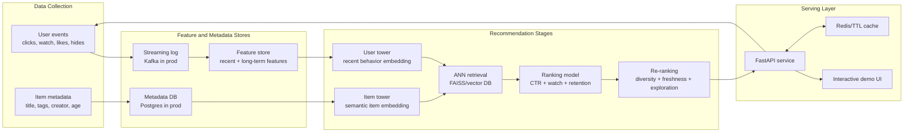

# Real-Time Multi-Stage Recommendation System

Link: https://real-time-multistage-recommender.onrender.com/

A machine learning system that mirrors a TikTok/YouTube-style recommender:

- Retrieval: two-tower user/item embeddings narrow the catalog to candidates.
- Ranking: a multi-objective ranker balances CTR, watch time, and retention.
- Re-ranking: diversity, freshness, and exploration shape the final slate.
- Real-time feedback: user events update recent features immediately.
- MLOps: offline evaluation, feature backfill, monitoring, and Render deployment config.

The live service is intentionally lightweight so it can deploy cleanly on Render free/starter instances. The optional training path uses PyTorch and FAISS without making the production API depend on heavy ML packages.

## Architecture



## What Is Implemented

- `src/realtime_recs/retrieval.py`: retrieval index with a dependency-free ANN stand-in and optional FAISS adapter.
- `src/realtime_recs/ranker.py`: inspectable multi-objective ranker.
- `src/realtime_recs/reranker.py`: diversity, creator de-duplication, freshness, and epsilon exploration.
- `src/realtime_recs/features.py`: recent and long-term user features, event weights, freshness, affinity, and skew-aware serving features.
- `src/realtime_recs/embeddings.py`: deterministic local embeddings plus an optional OpenAI embeddings provider for offline semantic vectors.
- `src/realtime_recs/api.py`: FastAPI dashboard/API, health checks, metrics, CORS, and event ingestion.
- `src/realtime_recs/pipelines/train_two_tower.py`: optional PyTorch pairwise retrieval training script.
- `src/realtime_recs/pipelines/evaluate.py`: offline precision/diversity evaluation.
- `render.yaml`, `.python-version`, and `Procfile`: Render-ready service config.

## Offline ML Workflow

Install optional training dependencies:

```bash
pip install -r requirements-train.txt
```

Run evaluation:

```bash
python -m realtime_recs.pipelines.evaluate --k 10
```

Backfill a feature snapshot:

```bash
python -m realtime_recs.pipelines.backfill_features --output data/processed/feature_snapshot.json
```

Materialize semantic item embeddings locally or with OpenAI:

```bash
RECSYS_EMBEDDING_PROVIDER=hashing python -m realtime_recs.pipelines.materialize_item_embeddings
```

To use OpenAI embeddings for offline item vectors, set `RECSYS_EMBEDDING_PROVIDER=openai`, `OPENAI_API_KEY`, and optionally `OPENAI_EMBEDDING_MODEL=text-embedding-3-small`. The live Render service defaults to local embeddings so it does not require secrets.

Train the retrieval model:

```bash
python -m realtime_recs.pipelines.train_two_tower --epochs 8 --output-dir data/artifacts
```

## Tests

```bash
python -m unittest discover -s tests
```

The core recommender tests use only the Python standard library. API contract tests run when FastAPI test dependencies are installed.
